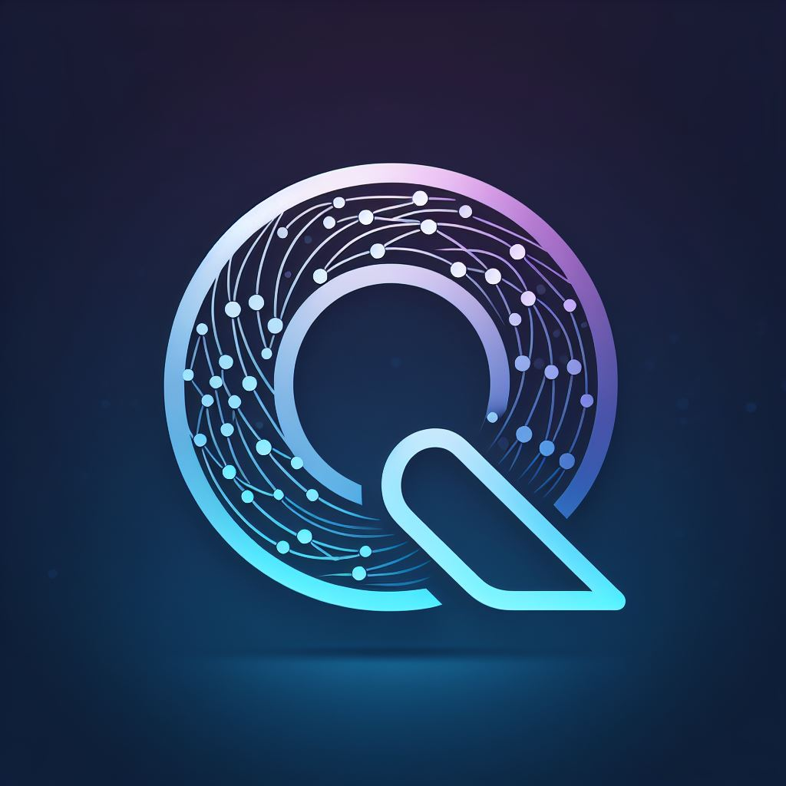

<!-- Improved compatibility of back to top link: See: https://github.com/othneildrew/Best-README-Template/pull/73 -->
<a name="readme-top"></a>
<!--
*** Thanks for checking out the Best-README-Template. If you have a suggestion
*** that would make this better, please fork the repo and create a pull request
*** or simply open an issue with the tag "enhancement".
*** Don't forget to give the project a star!
*** Thanks again! Now go create something AMAZING! :D
-->


<!-- PROJECT SHIELDS -->
<!--
*** I'm using markdown "reference style" links for readability.
*** Reference links are enclosed in brackets [ ] instead of parentheses ( ).
*** See the bottom of this document for the declaration of the reference variables
*** for contributors-url, forks-url, etc. This is an optional, concise syntax you may use.
*** https://www.markdownguide.org/basic-syntax/#reference-style-links
-->
[![MIT License][license-shield]][license-url]
[![LinkedIn][linkedin-shield]][linkedin-url]
[](http://20.64.115.37:9000/dashboard?id=quickshort)
[![Health Check][health-check]](https://quickshortapi.azurewebsites.net/actuator/health)

<!-- PROJECT LOGO -->
<br />
<div align="center">
  <a href="https://github.com/Great-Side-Projects/quickshortapi">
    
  </a>

  <h3 align="center">QuickShort API</h3>

  <p align="center">
    An awesome API to shorten urls!
    <br />
    <a href="https://quickshortapi.azurewebsites.net/v3/api-docs"><strong>Explore the docs »</strong></a>
    <br />
    <br />
    <a href="https://quickshortapi.azurewebsites.net/swagger-ui/index.html#/">View Demo</a>
    ·
    <a href="https://github.com/Great-Side-Projects/quickshortapi/issues">Report Bug</a>
    ·
    <a href="https://github.com/Great-Side-Projects/quickshortapi/issues/new">Request Feature</a>
  </p>
</div>


<!-- TABLE OF CONTENTS -->
<details>
  <summary>Table of Contents</summary>
  <ol>
    <li>
      <a href="#about-the-project">About The Project</a>
      <ul>
        <li><a href="#built-with">Built With</a></li>
        <li><a href="#Architecture-design">Architecture design</a></li>
        <li><a href="#Architecture-diagram">Architecture diagram</a></li>
        <li><a href="#URL-Shortening-Algorithm">URL Shortening Algorithm</a></li>
     </ul>
    </li>
    <li>
      <a href="#getting-started">Getting Started</a>
      <ul>
        <li><a href="#prerequisites">Prerequisites</a></li>
        <li><a href="#installation">Installation</a></li>
      </ul>
    </li>
    <li><a href="#usage">Usage</a></li>
    <li><a href="#roadmap">Roadmap</a></li>
    <li><a href="#contributing">Contributing</a></li>
    <li><a href="#license">License</a></li>
    <li><a href="#contact">Contact</a></li>
    <li><a href="#acknowledgments">Acknowledgments</a></li>
  </ol>
</details>

<!-- ABOUT THE PROJECT -->
## About The Project

[![Product Name Screen Shot][product-screenshot]](https://quickshortapi.azurewebsites.net/swagger-ui/index.html#/)
[![Product Name Screen Shot][product-screenshot-UI]](https://quickshortapi.azurewebsites.net/)

I remember when I was in an interview and they said to me, 'we need to create a URL shortener, we have 3 hours for the design and let's discuss the project.' Well, after we finished, I was left with many doubts that I couldn't let pass, so I decided to build it.
**Postscript: I got an email and didn't continue in the process :(.**

<p align="right">(<a href="#readme-top">back to top</a>)</p>

### Metrics with New Relic [![New Relic][New Relic]][New Relic-url]

This project is integrated with New Relic to Azure Services, , you can see the metrics. if you want to see the metrics, contact me and I will give you access to the dashboard.

[![Metrics][New-Relic]](https://onenr.io/0BQreX9Y8jZ) 

### Built With

* [![Java][java.com/es/]][Java-url]
* [![Spring Boot][Spring Boot]][Spring Boot-url]
* [![Redis][redis]][redis-url]
* [![Apache Kafka][Apache Kafka]][Apache Kafka-url]
* [![MongoDB][MongoDB]][MongoDB-url]
* [![RabbitMQ][RabbitMQ]][RabbitMQ-url] 

### Architecture diagram

The project is designed with Hexagonal Architecture, which is a software architecture that aims to create loosely coupled application components that can be easily connected to their software environment by means of ports and adapters. This makes the application more flexible to changes and easier to test.
<p align="right">(<a href="#readme-top">back to top</a>)</p>

### Architecture diagram
[![Architecture diagram][architecture-diagram]](https://quickshortapi.azurewebsites.net/)

<p align="right">(<a href="#readme-top">back to top</a>)</p>

### URL Shortening Algorithm

There are two algorithms to shorten the URL, the first one is **generateSHAShortUrl** is de default algorithm and the second one is **generateRandomShortUrl** is used when the first one builds a short URL that already exists in the database (collision). 
#### generateSHAShortUrl: 
This algorithm utilizes the SHA-256 hash function to generate a unique short URL from an original URL. Firstly, the original URL is encoded in UTF-8 to ensure consistency in character representation. Then, the SHA-256 hash is applied to the encoded URL, producing a unique and irreproducible value. Subsequently, the hash is converted into a Base64 string to facilitate manipulation and storage. Finally, the first characters of the encoded string are taken to form the short URL, ensuring a fixed length and readable representation of the original hash.

#### generateRandomShortUrl:
This algorithm generates a random short URL by selecting alphanumeric characters from a predefined set. Characters are randomly chosen from lowercase letters, uppercase letters, and digits from 0 to 9. These characters are concatenated to form the short URL. The result is a short URL that is unrelated to the original URL and is difficult to predict, making it suitable for use in situations where security and randomness are important.

![SequenceDiagram.png][sequence-diagram]
<p align="right">(<a href="#readme-top">back to top</a>)</p>

<!-- GETTING STARTED -->
## Getting Started

Here you can find the steps to run the project in your local environment to explore the API and the simple UI. 

### Prerequisites

This is an example of how to list things you need to use the software and how to install them.

* Java 17+
* Maven
* Redis cache local or cloud
* Apache Kafka local or cloud
* MonngoDB local or cloud
* Docker
* RabbitMQ local or cloud


### Installation


1. Clone the repo
   ```sh
   git clone https://github.com/Great-Side-Projects/quickshortapi.git
   ```
2. Go to the root folder of the project
   ```sh
   cd quickshortapi
   ```
3. find the 'Dockerfile_local' file and rename it to 'Dockerfile' 
   ```sh
   mv Dockerfile_local Dockerfile
   ``` 
4. Modify the `application.yaml` file with your own configuration
   ```yaml
   #Datasource configuration
   mongodb:
     uri: mongodb://localhost:27017/quickshort #url of your mongodb
   #Redis configuration
   redis:
     host: localhost #url of your redis
     port: 14612 #port of your redis
     password: password #password of your redis
   ##rabbitmq configuration
   rabbitmq:
     host: localhost #url of your rabbitmq
     port: 5672 #port of your rabbitmq
     username: admin #username of your rabbitmq
     password: password #password of your rabbitmq 
     queue:
       name: quickshort_deadletter #name of the queue
     #Kafka configuration
   kafka:
    bootstrap-servers: localhost:9092 #url of your kafka
    properties:
      sasl.jaas.config: org.apache.kafka.common.security.plain.PlainLoginModule required username="username" password="password"; #username and password of your kafka
    topic:
      name: quickshort #name of the topic
   ```
5. if you don't need kakfa authentication change de security properties in the `application.yaml` file
   ```yaml
   #Kafka configuration
   kafka:
     security:
      #if you require autentication use SASL_SSL instead of PLAINTEXT and configure the username and password
      protocol: SASL_SSL
      
   ```
   to
   ```yaml
   #Kafka configuration
    kafka:
      security:
        #if you require autentication use SASL_SSL instead of PLAINTEXT and configure the username and password
        protocol: PLAINTEXT
   ```
   
6. Generate the jar file. root folder of the project or use the IDE, verify jar file is target/*.jar.
   ```sh
   mvn clean install
   ``` 
7. Create image and run with docker. root folder of the project 
 
   ```sh
    docker build -t quickshortapi:latest .
    docker run -p 8080:8080 quickshortapi:latest
   ```
8. Open your browser and go to `http://localhost:8080/swagger-ui/index.html#/` to see the API documentation or `http://localhost:8080/` to see the simple UI QuickShort URL Management.
9. Enjoy!


<p align="right">(<a href="#readme-top">back to top</a>)</p>


<!-- USAGE EXAMPLES -->
## Usage

### Easy way:
Go to `http://localhost:8080/` and you can see the simple UI to manage the URLs.

### Medium way:
Go to `http://localhost:8080/swagger-ui/index.html#/` and you can see the API documentation to manage the URLs.

### Pro way:
Use CURL to manage the URLs.

1. Shorten URL by CURL
   ```sh
   #curl with header X-API-VERSION
   curl -X POST "http://localhost:8080/url/shorten" -H "accept: */*" -H "Content-Type: application/json" -H "X-API-VERSION: 1" -d "{ \"url\": \"https://www.google.com\"}"
   ```
2. Build the URL and redirect by CURL - take the shorturl from the response of the previous step 
   ```sh
    curl -X GET "http://localhost:8080/url/{shorturl}" -H "accept: */*"
   ```
3. or you can take de full url the second step ej: `http://localhost:8080/url/{shorturl}` and paste in your browser.
4. redirect will be to the original URL.
5. Enjoy!
   
_For more examples, please refer to the [Documentation](https://quickshortapi.azurewebsites.net/swagger-ui/index.html#/)_

<p align="right">(<a href="#readme-top">back to top</a>)</p>


<!-- ROADMAP -->
## Roadmap

- [x] Investigate about URL shortener
- [x] Architecture design with Hexagonal Architecture
- [x] Architecture diagram
- [x] Create API rest project with Spring Boot
- [x] Implement database with MongoDB
- [x] Implement URL shortener logic
- [ ] Implement Unit Tests
- [ ] Implement Integration Tests
- [x] Implement three party services
  - [x] Implement Redis for cache
  - [x] Implement Kafka for async communication
- [x] Implement Swagger for API documentation
- [x] Implement Docker for deployment
- [x] Implement CI/CD with GitHub Actions
- [x] Implement SonarQube for security
- [x] Create a simple front-end to manage the URLs
- [x] Health check for the API
- [x] Telemetry for the API
- [x] API versioning
- [x] Implement Circuit Breaker for security
- [x] Implement Rate Limit for security
- [ ] Implement Authentication for security

See the [open issues](https://github.com/Great-Side-Projects/quickshortapi/issues) for a full list of proposed features (and known issues).

<p align="right">(<a href="#readme-top">back to top</a>)</p>


<!-- CONTRIBUTING -->
## Contributing

Contributions are what make the open source community such an amazing place to learn, inspire, and create. Any contributions you make are **greatly appreciated**.

If you have a suggestion that would make this better, please fork the repo and create a pull request. You can also simply open an issue with the tag "enhancement".
Don't forget to give the project a star! Thanks again!

1. Fork the Project
2. Create your Feature Branch (`git checkout -b feature/AmazingFeature`)
3. Commit your Changes (`git commit -m 'Add some AmazingFeature'`)
4. Push to the "develop" Branch (`git push origin feature/AmazingFeature`)
5. Open a Pull Request

<p align="right">(<a href="#readme-top">back to top</a>)</p>


<!-- LICENSE -->
## License

Distributed under the MIT License. See `LICENSE.txt` for more information.

<p align="right">(<a href="#readme-top">back to top</a>)</p>


<!-- CONTACT -->
## Contact

Angel Morales - [LinkedIn](https://www.linkedin.com/in/angelmoralesb/) - angelmoralesb@gmail.com

Project Link: [https://github.com/Great-Side-Projects/quickshortapi](https://github.com/Great-Side-Projects/quickshortapi)

<p align="right">(<a href="#readme-top">back to top</a>)</p>


<!-- ACKNOWLEDGMENTS -->
## Acknowledgments

* [Choose an Open Source License](https://choosealicense.com)
* [Redis](https://redis.io/es/)
* [Apache Kafka](https://www.confluent.io/)
* [Kafka with Spring Boot](https://www.baeldung.com/spring-kafka)
* [Redis with Spring Boot](https://www.baeldung.com/spring-data-redis-tutorial)
* [MongoDB](https://www.mongodb.com/)
* [Docker](https://www.docker.com/)
* [Swagger Spring REST API](https://www.baeldung.com/spring-rest-openapi-documentation)
* [SonnarQube comunity Edition](https://www.sonarsource.com/open-source-editions/sonarqube-community-edition/)
* [GitHub Actions](https://docs.github.com/es/actions)
* [Sonarqube Docker Web App on Linux with Azure SQL](https://learn.microsoft.com/en-us/samples/azure/azure-quickstart-templates/webapp-linux-sonarqube-azuresql/)
* [Spring Boot with MongoDB](https://www.baeldung.com/spring-boot-mongodb)
 

<p align="right">(<a href="#readme-top">back to top</a>)</p>


<!-- MARKDOWN LINKS & IMAGES -->
<!-- https://www.markdownguide.org/basic-syntax/#reference-style-links -->
[contributors-shield]: https://img.shields.io/github/contributors/othneildrew/Best-README-Template.svg?style=for-the-badge
[contributors-url]: https://github.com/Great-Side-Projects/quickshortapi/graphs/contributors
[forks-shield]: https://img.shields.io/github/forks/othneildrew/Best-README-Template.svg?style=for-the-badge
[forks-url]: https://github.com/Great-Side-Projects/quickshortapi/forks
[stars-shield]: https://img.shields.io/github/stars/othneildrew/Best-README-Template.svg?style=for-the-badge
[stars-url]: https://github.com/Great-Side-Projects/quickshortapi/stargazers
[issues-shield]: https://img.shields.io/github/issues/othneildrew/Best-README-Template.svg?style=for-the-badge
[issues-url]: https://github.com/Great-Side-Projects/quickshortapi/issues
[license-shield]: https://img.shields.io/github/license/othneildrew/Best-README-Template.svg?style=for-the-badge
[license-url]: https://github.com/Great-Side-Projects/quickshortapi/blob/main/LICENSE
[linkedin-shield]: https://img.shields.io/badge/-LinkedIn-black.svg?style=for-the-badge&logo=linkedin&colorB=555
[linkedin-url]: https://www.linkedin.com/in/angelmoralesb/
[product-screenshot]: images/screenshot.png
[product-screenshot-UI]: images/screenshotUI.png
[architecture-diagram]: images/DesignArchitectureQuickShortv2.0.drawio.png
[sequence-diagram]: images/SequenceDiagram.png
[New-Relic]: images/metric.png
[health-check]: https://img.shields.io/badge/Health%20Check-UP-brightgreen
[Next.js]: https://img.shields.io/badge/next.js-000000?style=for-the-badge&logo=nextdotjs&logoColor=white
[Next-url]: https://nextjs.org/
[React.js]: https://img.shields.io/badge/React-20232A?style=for-the-badge&logo=react&logoColor=61DAFB
[React-url]: https://reactjs.org/
[Vue.js]: https://img.shields.io/badge/Vue.js-35495E?style=for-the-badge&logo=vuedotjs&logoColor=4FC08D
[Vue-url]: https://vuejs.org/
[Angular.io]: https://img.shields.io/badge/Angular-DD0031?style=for-the-badge&logo=angular&logoColor=white
[Angular-url]: https://angular.io/
[Svelte.dev]: https://img.shields.io/badge/Svelte-4A4A55?style=for-the-badge&logo=svelte&logoColor=FF3E00
[Svelte-url]: https://svelte.dev/
[Laravel.com]: https://img.shields.io/badge/Laravel-FF2D20?style=for-the-badge&logo=laravel&logoColor=white
[Laravel-url]: https://laravel.com
[Bootstrap.com]: https://img.shields.io/badge/Bootstrap-563D7C?style=for-the-badge&logo=bootstrap&logoColor=white
[Bootstrap-url]: https://getbootstrap.com
[JQuery.com]: https://img.shields.io/badge/jQuery-0769AD?style=for-the-badge&logo=jquery&logoColor=white
[JQuery-url]: https://jquery.com
[java.com/es/]: https://img.shields.io/badge/Java-ED8B00?style=for-the-badge&logo=java&logoColor=white
[Java-url]: https://www.java.com/es/
[Spring Boot]: https://img.shields.io/badge/Spring_Boot-F2F4F9?style=for-the-badge&logo=spring-boot
[Spring Boot-url]: https://spring.io/projects/spring-boot
[redis]: https://img.shields.io/badge/Redis-DC382D?style=for-the-badge&logo=redis&logoColor=white
[redis-url]: https://redis.io/
[Apache Kafka]: https://img.shields.io/badge/Apache_Kafka-231F20?style=for-the-badge&logo=apache-kafka&logoColor=white
[Apache Kafka-url]: https://kafka.apache.org/
[MongoDB]: https://img.shields.io/badge/MongoDB-4EA94B?style=for-the-badge&logo=mongodb&logoColor=white
[MongoDB-url]: https://www.mongodb.com/
[RabbitMQ]: https://img.shields.io/badge/RabbitMQ-FF6600?style=for-the-badge&logo=rabbitmq&logoColor=white
[RabbitMQ-url]: https://www.rabbitmq.com/
[New Relic]: https://img.shields.io/badge/New%20Relic-008C99?style=for-the-badge&logo=new-relic&logoColor=white
[New Relic-url]: https://newrelic.com/

